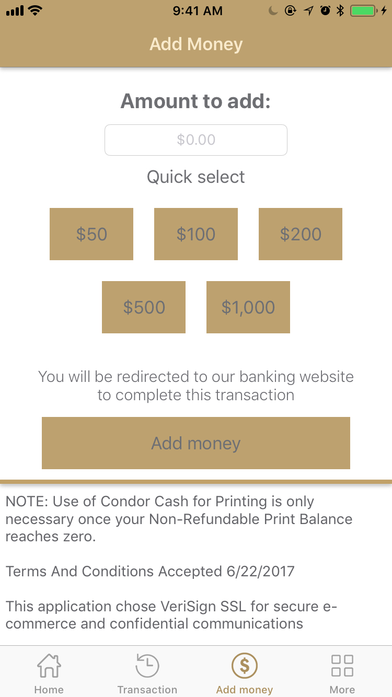

# Swift_ONECardMobileApp

A portal allows students and staff of Conestoga College access their identity card and manage their account.

The application provides the following main features:
  - Check Condor cash balance and Print credit
  - View transaction history
  - Add money to Condor cash account
  - Display virtual ONE Card
  - Suspend ONE Card
  - Recieve notification about events, promotions from ONE Card department

Signin screen

Home screen

Transaction history screen

Add money screen

More screen

Notification screen

Contact screen

This application was written in Swift 4.2 using xCode 10.
Version: 2.1.0
Release date: August 4, 2018
